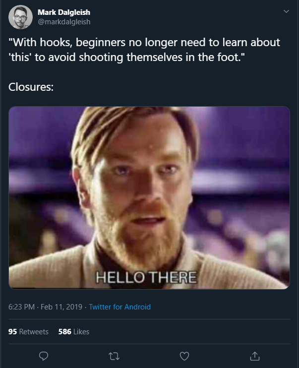

# THE WHY WHAT AND HOW OF REACT HOOKS

"Hooks are functions that let you “hook into” React state and lifecycle features from function components."
https://reactjs.org/docs/hooks-overview.html

Hook released 6/2/19 no breaking changes, can keep doing what you've always done and just explore hooks...

First use in Optix: refresh button commited on 13/2

We went with hooks early and I've not seen a class in a new commit for ages

Apollo, formik have or are(?) bringing out versions that use hooks...adoption has been quick...

## Why?

- less verbose - EXAMPLE NEEDED...just a screen print of side by side - must be some kicking around online
- less repetition/keep code that belongs together together, not spread over several lifecycle methods (and conversely, don't have unrelated code within a single lifecycle method) - include in the same example
- more composable - no more hoc (wrapper hell)
- allegdly 'this' is hard (but are closures harder?)

- React is just fxs calling fxs so classes are a bit outside that model

From the hooks rfc:
The main motivation is that patterns like closures naturally creates copies of values which makes writing concurrent code a lot easier because you can store n number of states at any given point instead of just one in the case of a mutable class. This avoids a number of foot guns where classes seem intuitive but actually yield unpredictable results.
https://github.com/reactjs/rfcs/pull/68

my version of the exmaple from https://overreacted.io/how-are-function-components-different-from-classes/ showing closures getting right result (fxs capture the render values) but "mutable this" getting wrong one
https://codesandbox.io/s/hooks-talk-classes-and-functions-difference-8i7yj

maybe show the class one first and then the correct function one?

"This exposes an interesting observation about the nature of user interfaces. If we say that a UI is conceptually a function of current application state, the event handlers are a part of the render result — just like the visual output. Our event handlers “belong” to a particular render with particular props and state.

However, scheduling a timeout whose callback reads this.props breaks that association. Our showMessage callback is not “tied” to any particular render, and so it “loses” the correct props. Reading from this severed that connection."

And if we think like Dan: "I like to think of React elements as being like frames in a movie. They capture what the UI should look like at a specific point in time. They don’t change." https://overreacted.io/react-as-a-ui-runtime/ then this mental model starts to make even more sense...

think about effects as synchronising the UI rather than as responding to lifecycle events https://overreacted.io/a-complete-guide-to-useeffect/

I wanna say something about rendering and reconciliation and elements/components/instances somewhere in this initial why section?

https://reactjs.org/blog/2015/12/18/react-components-elements-and-instances.html

## What?

- ootb hooks

## The rules of hooks: How?

There is a linter rule npm package for this

- only call hooks from react fxs not regular js - this one is pretty easy 😊
- only call hooks at the top level: don't call them inside loops, conditions or nested functions
  - call order cf its an array (or linked list) stuff https://codesandbox.io/s/izqhl
  - SO WHAT AM I GONNA SAY AOUT THIS?
- most common sighting of linter warnings: missing dependencies in useEffect - quote some stuff from the docs here as well probably

  - https://codesandbox.io/s/hooks-talk-useeffect-and-dependencies-c1b1c NEED TO IMPROVE THIS EXAMPLE CURRENTLY SUCKS
  - so we move the set timeout to useEffect since we want to run it once state has actually changed
  - and if we have no dependencies it works
  - but I don't want to run it every render, just after word has changed -> we don't get anything happen when the props also change so we get the wrong message
  - so we either:

    - add the function as a dep and wrap in useCallback
    - move the function inside useEffect
    - (or lift it out the component is another solution)

  - an example of useCallback was Email input focus issue: another component (email known) was rerendering because of callbacks being passed down as props -> that getting
  the focus so the issue was prevented by wrapping those in useCallback
  - it was also breaking debounce...check username executing for every letter, fx needed wrappingin useCallback so wasn't actually a different fx

## Write your own hooks (back to the what?)

- resuse stateful behaviour between components  https://codesandbox.io/s/usewindowwidth-z924w eg window resize and the rules of hooks apply here too because they are composed of other hooks (see text component)
- need an EXAMPLE and maybe compare to how would do if using classes?
  - formik or apollo have a look at their hooks?
  - useHooks site?
  - what about useTheme() instead of styled ocmponenet hoc and needing to pass theme in as a prop?? or something...
