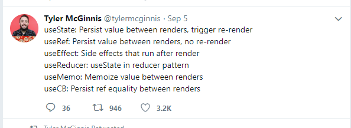

 Hook released 6/2/19 no breaking changes, can keep doing what you've always done and just explore hooks...

 First use in Optix: refresh button commited on 13/2

 We went with hooks early and I've not seen a class in a new commit for ages

"Hooks are functions that let you “hook into” React state and lifecycle features from function components."
https://reactjs.org/docs/hooks-overview.html
 
 ## Why?
 - less verbose - example
 - less repetition/keep code that belongs together together, not spread over several lifecycle methods (and conversely, don't have unrelated code within a single lifecycle method) - include in the same example
 - more composable - no more hoc (wrapper hell)
 - React is just fxs calling fxs so classes are a bit outside that model
 - allegdly 'this' is hard (but are closures harder?)

 From the hooks rfc:
 The main motivation is that patterns like closures naturally creates copies of values which makes writing concurrent code a lot easier because you can store n number of states at any given point instead of just one in the case of a mutable class. This avoids a number of foot guns where classes seem intuitive but actually yield unpredictable results.
https://github.com/reactjs/rfcs/pull/68

## Aside - quick reminder re closures
- maybe show the EXAMPLE from overreacted showing closures getting right result but mutable this getting wrong one? something like that

## What?
- ootb hooks > what the rules of hooks tell us about how they work

- write your own hooks

## The rules of hooks
?cover talking through some of the ootb hooks here?

There is a linter rule npm package for this

- only call hooks from react fxs not regular js - this one is pretty easy :-)
- only call hooks at the top level: don't call them inside loops, conditions or nested functions
     - call order cf its an array (or linked list) stuff
- most common sighting of linter warnings: missing dependencies in useEffect 
    - need to find an EXAMPLE of this and why it matters
    - functions/ref equality and solutions to that

## Write your own hooks
- resuse stateful behaviour between components
- need an EXAMPLE and maybe compare to how would do if using classes?
    - formik or apollo have a look at their hooks?
    - useHooks site?
    

